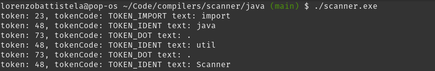

# Compilers Study

This project aims to study compilers, how they work and how to build them. To achieve this, I'm building it's parts separately so that I can bring them together sometime.

The first part is the scanner.

## Scanner

I implemented two scanners, one for JSON files and other for Java files. The first one aims to separate structuring from data tokens. That said, it identifies curly braces, colons and strings.

The java one identifies keywords, operators, identifiers and other java structure stuff, although there are some things that are missing (for example float literals, string literals, addresses, hexadecimal, etc).

### Testing the project

You can test both scanners out. Let's start with the JSON one.
First clone the repo using `git clone https://github.com/Lorenzobattistela/compilers.git`
Then: `cd compilers/scanner/json`

If you're going to change one of the following files: `main.c scanner.flex`, make sure you have dependencies installed, because you need to recompile. You need gcc and flex:

To install flex: `sudo apt install flex`
For windows, follow [this](https://www.geeksforgeeks.org/how-to-install-flex-on-windows/).

If you did not change anything, simply make sure you have a file named `somefile.json` at `compilers/scanner/java` and then run the executable with:

`./scanner.exe`

You'll see the following output (using the same json i did):

If you changed anything, before running the executable, compile it with:
`flex -o flex.c scanner.flex`
`gcc -o scanner.exe main.c flex.c`

Now let's go to the Java project:

`cd compilers/scanner/java`

Make sure you have a file named `test.java` in the same directory.
If you changed anything, before running the executable, compile it with:
`flex -o flex.c scanner.flex`
`gcc -o scanner.exe main.c flex.c token.c`

And run the executable with:

`./scanner.exe`

You'll se an output like:

Feel free to contribute and report any errors!

## Parser

To run the parser, make sure you have `bison` and `flex` installed. Then, run the following commands:
`make`
This will result in a `calc.exe` file, and you can simply run it with: `./calc`